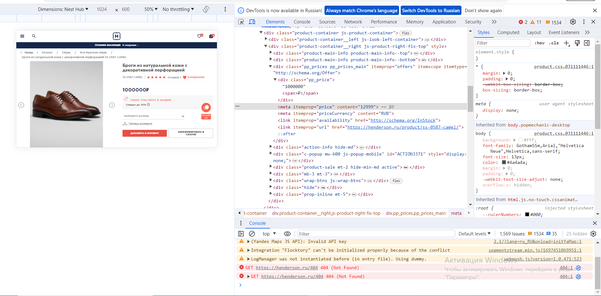
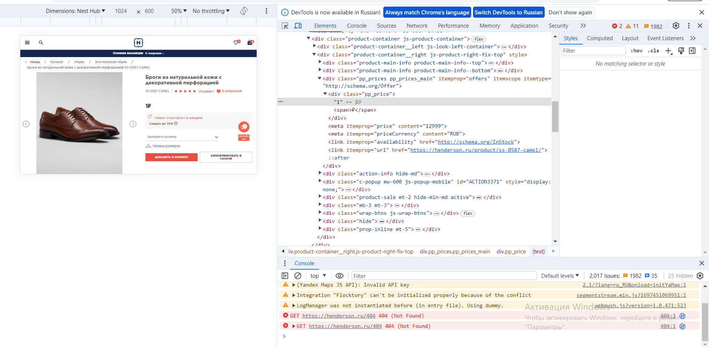
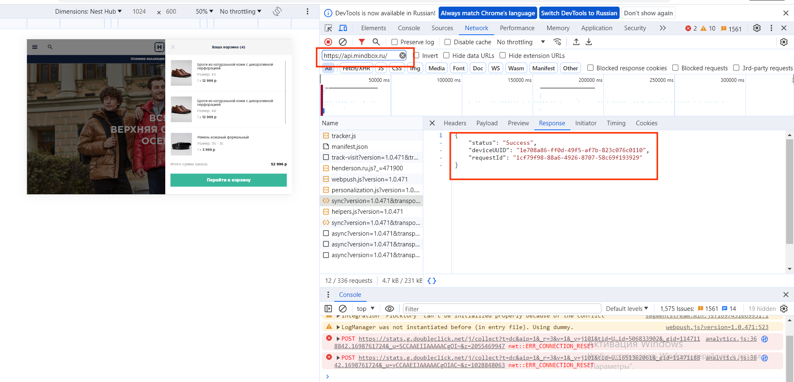

# Курсовой проект к модулю «Ручное тестирование веб-приложений»

## Задание 1

Написать чеклист для функциональной проверки [личного кабинета зарегистрированного авторизованного пользователя](https://henderson.ru/cabinet/), включая функционал разделов, на сайте https://henderson.ru/.

**Требования к выполнению**
* Чеклист должен представлять собой структурированный многоуровневый список, который содержит набор функциональных позитивных и негативных проверок клиентской стороны компонентов объекта тестирования.
* Каждый пункт проверки в должен быть в отдельной ячейке списка и со своим приоритетом.
* При составлении списка проверок должны учитываться различные варианты состояний страниц. Например, при проверке функции «Мои отзывы» мы проверяем не только состояние без отзывов, но и с ними.
* Мы ожидаем от вас список проверок функционала личного кабинета без учёта хедера и футера страницы, то есть то, что есть в этой [области](https://u.netology.ru/backend/uploads/lms/content_assets/file/995/%D0%91%D0%B5%D0%B7_%D0%BD%D0%B0%D0%B7%D0%B2%D0%B0%D0%BD%D0%B8%D1%8F__1_.png).

## [Решение №1](https://docs.google.com/spreadsheets/d/1a3qpwoZNXPQ1UicWw4SLcrsh5n8Np7Y2DsKonZDdR7o/edit#gid=0)

## Задание 2

2.1. Необходимо написать набор тест-кейсов на проверку функционала восстановления пароля.

Ваша задача — написать минимум 15 тест-кейсов, которые должны покрывать всё, что описано в требованиях по
[ссылке](https://u.netology.ru/backend/uploads/lms/content_assets/file/996/%D0%9F%D0%BE%D0%BB%D1%8C%D0%B7%D0%BE%D0%B2%D0%B0%D1%82%D0%B5%D0%BB%D1%8C%D1%81%D0%BA%D0%B8%D0%B9_%D1%81%D1%86%D0%B5%D0%BD%D0%B0%D1%80%D0%B8%D0%B9_%D0%BF%D0%BE_%D0%BF%D1%80%D0%BE%D1%86%D0%B5%D1%81%D1%81%D1%83_%D0%B2%D0%BE%D1%81%D1%81%D1%82%D0%B0%D0%BD%D0%BE%D0%B2%D0%BB%D0%B5%D0%BD%D0%B8%D1%8F_%D0%BF%D0%B0%D1%80%D0%BE%D0%BB%D1%8F_%D0%BD%D0%B0_%D1%81%D0%B0%D0%B9%D1%82%D0%B5_henderson.docx), учитывать позитивные и негативные кейсы и включать в себя полные циклы восстановления пароля.
Помните, что мы проверяем не только и не столько саму форму, сколько процесс восстановления с применением техник тест-дизайна.
Обратите внимание, что основа для написания тестов — информация в требованиях, а не на реальном сайте. К тому же сейчас не все требования можно реализовать на реальном сайте.

2.2.*  Напишите свои вопросы по этим требованиям. Они могут касаться не описанных, но важных сценариев, граничных значений и подобных проблем, по аналогии с ДЗ.

## [Решение №2.1](https://docs.google.com/spreadsheets/d/1MMXlA2XtgvfIbdsobbSg98PWGk9XGgci84ExrMqSnA8/edit#gid=0)
## [Решение №2.2](https://docs.google.com/document/d/1nAcOc1xWTCCnLS7UKoJ9RRmwCPv1s0YE_vESL_B2Qj8/edit)

## Задание 3

3.1. На основе [скриншота](https://u.netology.ru/backend/uploads/lms/content_assets/file/997/%D0%91%D0%B5%D0%B7_%D0%BD%D0%B0%D0%B7%D0%B2%D0%B0%D0%BD%D0%B8%D1%8F__2_.png) создайте не менее трёх баг-репортов. Обратите внимание, что здесь в окружении мы можем описать тот браузер, с которого проводилась бы проверка, то есть ваш актуальный.

3.2.* Найдите баг в функции «Написать отзыв» в карточке товара и составьте на него баг-репорт. Если найдёте несколько — замечательно!

## [Решение №3.1](https://docs.google.com/spreadsheets/d/1-MNAJuTz07BoJM2FtzQJcmXC4OjVSCsvcUeDJK-WUl4/edit#gid=0)
## [Решение №3.2](https://docs.google.com/spreadsheets/d/1WXN-nEMw4hAU8VrSZejgvs0zI99ZlJqj2HBWebReMlc/edit#gid=0)

## Задание 4

Вы тестируете страницу карточки товара. Из ТЗ вы знаете, что товар может стоить от 1 рубля до 10 000 000 рублей. К сожалению, на сайте сейчас товаров с такой ценой нет, а разработчик бэкенда в отпуске, поэтому вам нужно протестировать вёрстку страницы карточки товара с максимальной и минимальной ценой самостоятельно.
Ваша задача — самостоятельно определить, как проще это сделать, и предоставить решение в виде скриншотов страницы карточки товара с минимальной и максимальной ценой. Важно, чтобы было видно, с помощью чего вы изменили эту цену.

## Решение №4

## Задание 5

Бэкенд-разработчик говорит, что мы отправляем данные с сайта в неправильном формате, и просит вас помочь найти нужный запрос. Фронтенд-разработчик ушёл в отпуск в поход без связи, а документация пропала.

Известно, что проблема в данных, которые уходят в POST запросе по адресу, который начинается с https://api.mindbox.ru/. Происходит это, скорее всего, при работе с личными данными пользователя, например, авторизацией, личным кабинетом, просмотром корзины.

Ваша задача — изучить ответы и запросы при работе с сайтом, найти запрос, в котором есть нужные параметры, найти, как же выглядят параметры deviceUUID, requestID и status, и приложить скриншот искомого превью в таблицу с решениями.

Обратите внимание, что задание надо выполнять с выключенным VPN и выключенными блокировщиками рекламы.

## Решение №5
